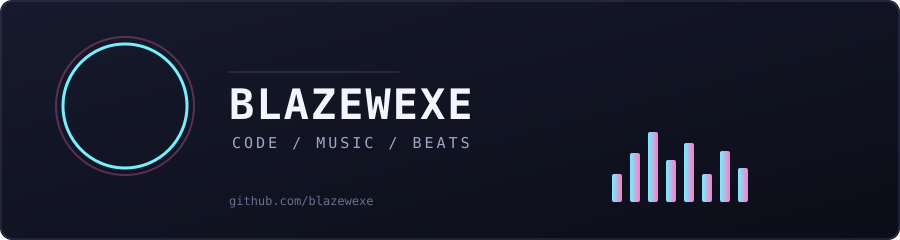

  

## Song chain

Anyone can drop the next song. Whatever gets suggested becomes the track playing here, and the chain keeps growing.

<!--SONG:START-->
<table><tr>
<td></td>
<td valign="top">
NOW PLAYING 
<h3><a href="https://open.spotify.com/track/2YiCMmONQcoMPX2bV1LxE0">Everybody Wants To Rule The World</a></h3>
Tears For Fears 
Songs From The Big Chair  
suggested by <a href="https://github.com/blazewexe"><b>@blazewexe</b></a> on 2026-10-01 
song #1 in the chain
</td></tr></table>

<a href="https://open.spotify.com/playlist/6NCd9oMmTrVp2WfrmRXusY?si=F27DyvP9TqSmKjbJ2ugCqg">Listen to the full playlist (1 songs and counting)</a>
<!--SONG:END-->

  <a href="https://github.com/blazewexe/blazewexe/issues/new?template=suggest.yml&title=suggest"><b>Suggest the next song</b></a>

## How to play

1. Open a song in Spotify, press Share, then Copy Song Link.
2. Click **Suggest the next song** above and paste the link into the form.
3. Submit the issue. A GitHub Action reads the link, looks the track up on Spotify, and updates this page in about a minute.

Rules: Spotify track links only, one suggestion per person per day, no repeats, and clean (non-explicit) tracks only. The issue closes itself with a note on whether your song made it.

## Make an infinite playlist like this

The whole thing runs on GitHub Issues, GitHub Actions and the Spotify API. No server needed.

1. Create a repo named exactly like your username (this is your profile README).
2. Copy the files from this repo: `README.md`, `assets/`, `data/`, `scripts/` and `.github/`.
3. Create an app at the Spotify developer dashboard and add its client id and secret as repo secrets named `SPOTIFY_CLIENT_ID` and `SPOTIFY_CLIENT_SECRET`.
4. Optional, for the real playlist: create a public Spotify playlist, run `scripts/get_refresh_token.py` once, and add `SPOTIFY_REFRESH_TOKEN` and `SPOTIFY_PLAYLIST_ID` as secrets. Every accepted song then gets appended to it automatically.
5. Change the names and links in `README.md`, edit `scripts/make_header.py` for your own header, and push.

Full walkthrough is in [SETUP.md](SETUP.md).
